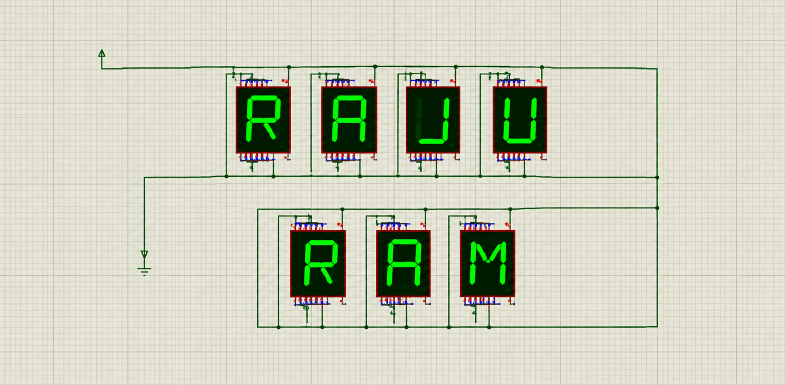

<!-- ========================= HEADER ========================= -->

<h1 align="center">Hi 👋, I'm Raju Ram</h1>

<h3 align="center">
Electronics & Communication Engineering Student | VLSI | Embedded Systems | IoT
</h3>

<p align="center">
  
</p>

---

<p align="center">
  
</p>

## 👨‍💻 About Me

🎓 I'm an **Electronics & Communication Engineering (ECE)** student from India.

💡 I'm passionate about **VLSI, Embedded Systems, IoT and Electronics**.

🔌 I enjoy working with **ESP32, Arduino, Raspberry Pi, sensors and microcontrollers**.

💻 I also build software using **Python, C/C++, HTML, CSS and JavaScript**.

🚀 My goal is to combine **hardware + software** to build useful real-world systems.

🌱 Currently learning:

- Digital Electronics
- VLSI Design
- Verilog / HDL
- Embedded Systems
- IoT
- Microcontrollers
- Python
- Machine Learning

---

## ⚡ Electronics & Embedded

<p align="center">
  
</p>

<p align="center">
  <b>Build • Connect • Program • Automate 🔌🤖</b>
</p>

---

## 🛠️ Languages & Tools

### 💻 Programming Languages

<p align="left">


</p>

### 🔌 Embedded & Hardware

<p align="left">


</p>

**ESP32 • Arduino • Raspberry Pi • 8051 • Sensors • IoT**

### 🌐 Web & Development

**HTML • CSS • JavaScript • Python • Git • GitHub**

---

## 🚀 What I'm Building

🔹 ESP32 based IoT projects  
🔹 Sensor monitoring systems  
🔹 Raspberry Pi projects  
🔹 Embedded systems  
🔹 Electronics automation  
🔹 AI-powered applications  
🔹 Hardware + Software projects  

---

## 📌 Featured Projects

### 🔌 ESP32 Projects
Wi-Fi, sensors, automation and IoT projects using ESP32.

### 🌱 Smart Agriculture
IoT-based monitoring and automation solutions for agriculture.

### 🧠 AI Projects
Python and AI-powered applications using APIs and machine learning.

### 🤖 Embedded Systems
Microcontroller and sensor-based electronics projects.

---

## 🎯 Career Goals

```text
Electronics
     ↓
Digital Electronics
     ↓
VLSI Design
     ↓
Verilog / HDL
     ↓
Embedded Systems
     ↓
IoT
     ↓
AI + Hardware
